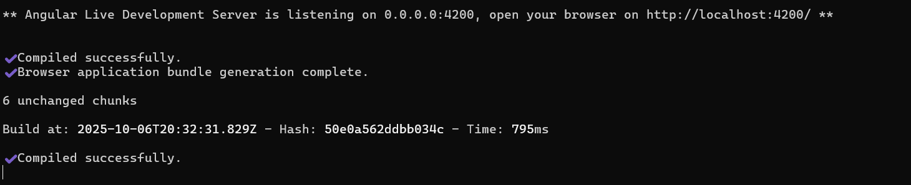
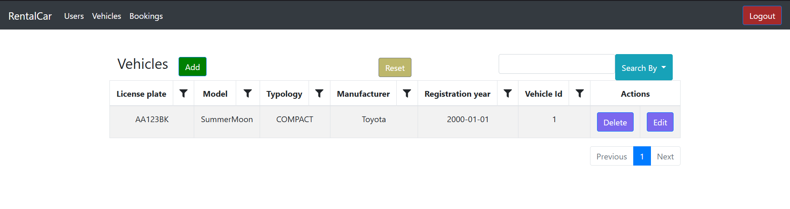

# Angular RentalCar

Front-end Angular project of a simple rental car application.

## Table of Contents

 - [General Info](#general-info)
 - [Introduction](#introduction)
 - [Technologies](#technologies)
 - [Setup](#setup)
 - [Illustrations](#illustrations)
 - [Functionalities](#functionalities)
 - [Links](#-links)
 

## General Info

A front-end project made of three entities: vehicles, users, bookings. Each user can rent a vehicles for a period of time. Some users are 'SUPERUSER' and they are the admin. They can insert, update, delete each data in the database. Other users are 'CUSTOMER'. An user cannot rent a car in the period he has rented another car. When an user rent a car the request must be approved first before renting another one. Only 'SUPERUSER' can approve the bookings.
## Introduction

The goal of this project is to learn how [Angular](https://angular.io/) works. There is a login page, a page for the vehicles, a page for the customers and a page for the bookings and each of them are represented by a dynamic table. It can be sorted, filtered and the user can search whatever data they need. An header will guide the user through all the possible actions. The page of users can be visited just from the 'SUPERUSER'.
## Technologies
- Angular 13.2.6
## Setup

When you'll lunch the application, there is no data because you have to lunch firstly the back-end. Read here to setup it: [Back-end RentalCar](https://github.com/LVisir/spring-rental-car#readme) (it takes just a few minutes). After the back-end is running, just clone this repo and run ```./deploy.sh```, wait the response untill the compilation is complete. The app is running on localhost:4200. **NOTE: before launch check if the port 4200 is free!**

When you'll see something like this the app is ready:


SUPERUSER credentials:
```
test@gmail.com
```
```
1234
```

CUSTOMER credentials:
```
caccamo@gmail.com
```
```
1234
```
## Illustrations

A brief overview of a page of an entity:


## Functionalities

The ```src/app/components/custom-table``` is the generic dynamic table in which all the data will adapt to. 

Each page cannot be accessible if there isn't the jwt token in the header of the http message requesting the page (read more in [Back-end RentalCar](https://github.com/LVisir/spring-rental-car#readme)). For the login request the email and the password of the user in the current session are mixed with a secret key that generate the token. If the email and the password exists in the db, the token will be generated and saved inside the session storage. Every request are catched by an interceptor.

A page is composed by an ```header``` component, a ```custom-table``` component and various ```button``` component to interact with the page.

The core of this project is all inside ```src/app/components/``` which have all the element needed for the app.
## 🔗 Links
[](https://github.com/LVisir)
[](https://www.linkedin.com/in/edoardo-mariani-2903a5262/)

